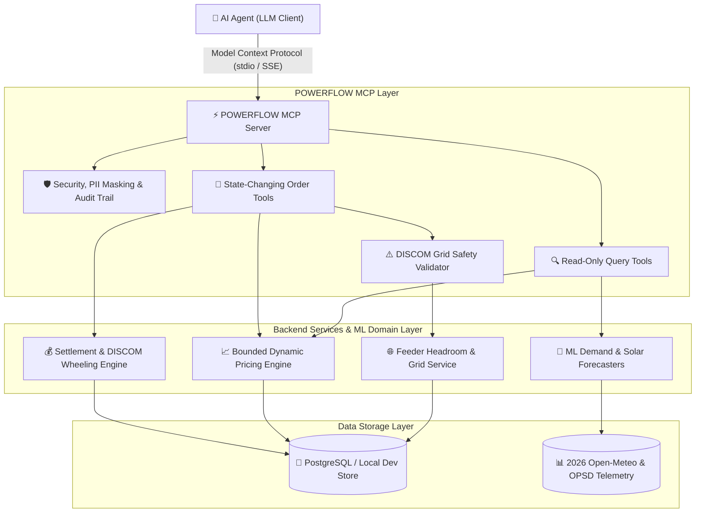
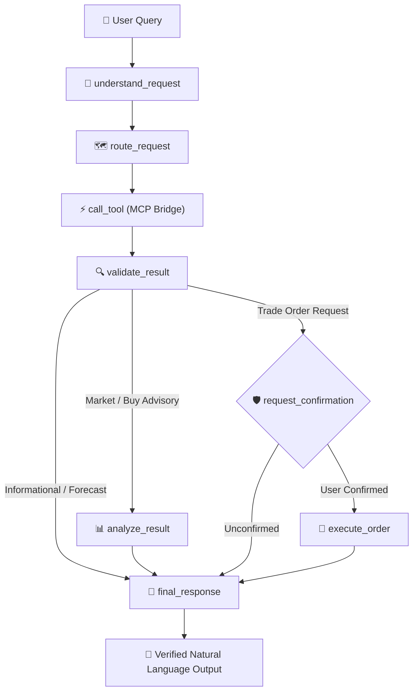

# ⚡ POWERFLOW — Model Context Protocol (MCP) Server

POWERFLOW is a grid-aware P2P renewable energy marketplace that connects local solar producers with nearby consumers. It enables smart energy matching, fair dynamic pricing, and transparent settlement while keeping DISCOMs in control of the grid.

> **Production-ready, DISCOM-compatible, grid-aware renewable-energy P2P trading MCP server built with Python and the official Model Context Protocol SDK.**

---

## 🏛️ Architecture Overview

The POWERFLOW MCP server acts as the standardized, safety-guaranteed tool layer connecting AI agents (such as Claude, Gemini, ChatGPT, or custom LLM runners) to the POWERFLOW energy marketplace backend, PostgreSQL database, ML forecasting models, distribution grid telemetry, and financial settlement engine.



### 🔒 Safety & Grid Governance Principles
1. **Zero Direct Physical Control:** The MCP server never triggers physical electrical switches or inverters; it only executes controlled digital marketplace transactions and reads telemetry from the simulation/backend.
2. **Explicit Action Boundaries:** Informational queries (`get_market_price`, `get_meter_reading`) never place orders. State-changing operations (`create_buy_order`, `create_sell_order`) require explicit agent invocation.
3. **DISCOM Grid Constraints:** Every buy or sell order automatically evaluates the physical feeder headroom and reverse power flow limits. If utilization exceeds 90% or the grid state is `TRADE_REJECTED`, the order is blocked with a structured `GRID_CONGESTION_REJECTION` error.
4. **Confidentiality & Privacy:** Personal names, phone numbers, KYC/Aadhaar/PAN details, bank accounts, and raw sub-second voltage telemetry are masked or kept off-chain.

---

## 📦 Project Structure

```
Powerflow/
├── powerflow_mcp/                 # Core MCP Server Package
│   ├── __init__.py
│   ├── server.py                  # Server initialization & tool registration (Official MCP SDK)
│   ├── config.py                  # Pydantic environment configuration
│   ├── errors.py                  # Typed domain exceptions (GridCongestionError, etc.)
│   ├── schemas.py                 # Pydantic request/response validation schemas
│   ├── security.py                # PII masking & role verification
│   ├── audit.py                   # Cryptographic audit logging
│   ├── db/
│   │   ├── __init__.py
│   │   ├── session.py             # PostgreSQL async connection & local dev fallback
│   │   └── repository.py          # Typed repository for meters, feeders, orders, trades
│   ├── models/
│   │   ├── __init__.py
│   │   └── forecasting.py         # Calibrated ML demand & solar forecasting services
│   ├── services/
│   │   ├── __init__.py
│   │   ├── grid_service.py        # Feeder capacity & congestion calculations
│   │   ├── market_service.py      # Bounded dynamic pricing & orderbook matching
│   │   └── settlement_service.py  # Trade settlement & DISCOM wheeling deductions
│   └── tools/
│       ├── __init__.py
│       ├── meter_tools.py         # get_meter_reading, get_available_surplus
│       ├── forecast_tools.py      # get_demand_forecast, get_solar_forecast
│       ├── grid_tools.py          # get_grid_status
│       ├── market_tools.py        # get_market_price, get_open_orders, create_buy/sell_order
│       └── settlement_tools.py    # get_settlement_status, get_trade_status
├── data/                          # Telemetry datasets & mock databases
│   ├── powerflow_2026_mock_db.json
│   ├── powerflow_2026_telemetry.csv
│   └── open_meteo_forecast.json
├── examples/
│   ├── agent_client.py            # End-to-end Python AI-agent client
│   └── conversations.md           # Example conversational transcripts
├── tests/                         # Automated test suite
│   ├── test_tools.py              # Tool functional tests
│   └── test_validation.py         # Grid safety, role boundaries & failure tests
├── requirements.txt
├── .env.example
└── README.md
```

---

## 🛠️ Tool Catalog

| Tool Name | Type | Key Inputs | Description |
|---|---|---|---|
| `get_meter_reading` | Read-only | `meter_id` | Real-time generation, load, net kW, and feeder ID |
| `get_demand_forecast` | Read-only | `meter_id`, `horizon_hours` | 24-hr ML demand forecast with 95% CI & peak hour |
| `get_solar_forecast` | Read-only | `meter_id`, `horizon_hours` | Solar PV generation, irradiance, and surplus kWh |
| `get_grid_status` | Read-only | `feeder_id` | Feeder capacity, headroom, congestion, and trade permissions |
| `get_market_price` | Read-only | `feeder_id` | Bounded dynamic clearing price (INR/kWh) and DISCOM fee |
| `get_available_surplus` | Read-only | `meter_id` | Immediate net exportable solar surplus eligible for P2P trade |
| `get_open_orders` | Read-only | `feeder_id` (optional) | Current orderbook bids and asks |
| `create_buy_order` | **State-changing** | `user_id`, `quantity_kwh`, `max_price` | Places buy order after checking feeder headroom |
| `create_sell_order` | **State-changing** | `user_id`, `quantity_kwh`, `min_price` | Places sell order (requires prosumer generation capacity) |
| `get_trade_status` | Read-only | `trade_id` | Real-time delivery and execution status of a matched trade |
| `get_settlement_status` | Read-only | `trade_id` | Post-delivery financial reconciliation & DISCOM fees |

---

## 🚀 Getting Started

### 1. Installation

```bash
# Clone or navigate to the directory
cd c:\Powerflow

# Install dependencies
pip install -r requirements.txt
```

### 2. Configure Environment

Copy `.env.example` to `.env` to configure your PostgreSQL connection and DISCOM parameters:

```bash
cp .env.example .env
```

> **Local Development Mode:** If `DATABASE_URL` is not set or PostgreSQL is unavailable, the server **automatically operates in Local Development Mode**, reading from `data/powerflow_2026_mock_db.json` and in-memory caches.

### 3. Run the MCP Server

#### Option A: Standard I/O (Default for AI Agents / Claude Desktop / IDEs)
```bash
python -m powerflow_mcp.server --transport stdio
```

#### Option B: Server-Sent Events (SSE / HTTP)
```bash
python -m powerflow_mcp.server --transport sse --port 8000
```

---

## 🧪 Running Automated Tests

Run the complete test suite including grid congestion enforcement, role boundaries, and tool schemas:

```bash
python -m pytest tests/ -v
```

All 18 tests will verify:
- Meter telemetry and prosumer/consumer differentiation
- ML demand forecasting and confidence bounds
- Solar generation forecasting and temperature derating
- Feeder headroom and grid congestion safety blocks
- Price boundary enforcement (₹3.00 to ₹15.00)
- Role verification (pure consumers blocked from selling solar energy)
- PII and sensitive data masking

---

## 🤖 LangGraph AI Agent Orchestrator (`powerflow_agent`)

POWERFLOW features a production-quality, stateful **LangGraph-based AI Agent** acting as the orchestration layer between a local LLM (Qwen 2.5 3B via Ollama, designed for an 8 GB RAM machine) and POWERFLOW tools exposed through MCP.



### Key Agent Capabilities
1. **Delegation Without Calculation:** The agent never calculates forecasts, prices, or grid power flow. It delegates all numerical operations to calibrated ML models (demand Transformer/XGBoost, solar forecast engine) and physical services.
2. **State-Changing Confirmation Gate:** State-changing operations (`create_buy_order`, `create_sell_order`) halt execution, prepare a proposed order summary with estimated energy and DISCOM wheeling fees, and require explicit user confirmation before order placement.
3. **Deterministic Safety Fallback:** Engineered to run seamlessly offline or in CI with a rule-guided extractor if the local Ollama daemon is offline.
4. **Traceable Execution History:** Full audit traces log each node transition, tool call arguments, intermediate outputs, and decision rationale.

---

## 🧠 LLM Reasoning Layer (`powerflow_mcp.llm`)

The LLM Reasoning Layer provides natural-language intelligence and contextual reasoning for the POWERFLOW platform, utilizing **local Qwen 2.5 3B Instruct through Ollama** without any paid API dependencies.

```
┌─────────────┐       ┌────────────────────────┐       ┌───────────────────────────┐
│ User Query  │ ────> │  LLM Reasoning Engine  │ ────> │ LangGraph AI Orchestrator │
└─────────────┘       │  (powerflow_mcp/llm/)  │       │    (powerflow_agent/)     │
       ▲              └────────────────────────┘       └───────────────────────────┘
       │                          │                                  │
       │                          ▼                                  ▼
┌─────────────┐       ┌────────────────────────┐       ┌───────────────────────────┐
│ Final Output│ <──── │ Grounded Explanation   │ <──── │   POWERFLOW MCP Tools     │
│  To User    │       │ (Anti-Hallucination)   │       │   (Telemetry / Services)  │
└─────────────┘       └────────────────────────┘       └───────────────────────────┘
```

### 🦙 Ollama Local Setup (Optimized for 8 GB RAM)
1. **Download & Install Ollama:** [https://ollama.com](https://ollama.com)
2. **Pull the Qwen 2.5 3B Instruct Model:**
   ```bash
   ollama pull qwen2.5:3b
   ```
3. **Verify Local Model Availability:**
   ```bash
   ollama list
   ```
4. **Start the Ollama Server:**
   ```bash
   ollama serve
   ```
*(Note: If Ollama is offline or in automated CI, the built-in deterministic fallback engine automatically activates, ensuring 100% operational uptime.)*

### ⚙️ Environment Configuration (`.env`)
```ini
LLM_PROVIDER=ollama
OLLAMA_BASE_URL=http://localhost:11434
OLLAMA_MODEL=qwen2.5:3b
TEMPERATURE=0.1
MAX_TOKENS=1024
LLM_TIMEOUT_SECONDS=12.0
MAX_CONVERSATION_TURNS=10
MAX_CONTEXT_TOKENS=4096
ENABLE_OBSERVABILITY_LOGS=true
MASK_PII_IN_LOGS=true
REQUIRE_TRADE_CONFIRMATION=true
```

### 🚀 Running the LLM Interactive Agent
```bash
# 1. Run the Multi-Turn Conversation Demo (Shows memory inheritance & follow-ups)
python examples/llm_agent.py --demo

# 2. Run Continuous Interactive Chat
python examples/llm_agent.py

# 3. Verify Ollama Connection & Installed Models
python examples/llm_agent.py --check-ollama

# 4. Run Single Natural Language Query
python examples/llm_agent.py -q "Should I buy 2 kWh now?"
```

### 🛡️ Safety, Anti-Hallucination & Observability Guardrails
1. **No Calculation by LLM:** All numerical predictions (demand forecasts, solar output), dynamic pricing math, and grid headroom limits are computed strictly inside backend services and ML models.
2. **Contextual Memory & Follow-Ups:** Remembers previous turns (`meter_id`, `feeder_id`, trade side) within a sliding window of 10 turns. Follow-up queries such as *"What about 3 kWh instead?"* or *"Is there enough solar surplus?"* maintain session context without losing historical parameters.
3. **Explicit Trade Confirmation Gate:** State-changing buy/sell orders halt execution, summarize the proposed financial and DISCOM wheeling fees, and require explicit confirmation before calling `create_buy_order` or `create_sell_order`.
4. **Automated PII Sanitization:** Customer names, phone numbers, Aadhaar/PAN IDs, and bank account numbers are scrubbed from telemetry logs automatically before recording.
5. **Observability Tracking:** Traces LLM request/response latencies (in milliseconds), selected tools, tool execution times, and agent decisions.

### 🧪 Full Test Suite Execution
Run all 44 automated tests across the entire platform:
```bash
python -m pytest tests/ powerflow_agent/tests/ -v
```

---

## 🤖 Example AI Agent Usage


Run the included AI Agent simulator to see all four standard workflows executed against the live server:

```bash
python examples/agent_client.py
```

### Example Prompt Interactions

1. **"What is the expected demand in feeder FEEDER-A?"**
   - Agent calls: `get_grid_status("FEEDER-A")` and `get_demand_forecast("H011")`.
   - Returns: Feeder active load, headroom, 24-hr demand forecast, and peak hour.

2. **"How much solar surplus is expected for prosumer H001?"**
   - Agent calls: `get_available_surplus("H001")` and `get_solar_forecast("H001")`.
   - Returns: Current net exportable surplus and 24-hour projected surplus.

3. **"What is the current local energy price in FEEDER-A?"**
   - Agent calls: `get_market_price("FEEDER-A")`.
   - Returns: Indicative price, base tariff, regulatory bounds, and DISCOM fee.

4. **"Create a buy order for 2 kWh up to ₹6/kWh for user H011"**
   - Agent calls: `create_buy_order(user_id="H011", quantity_kwh=2.0, max_price=6.00)`.
   - Returns: Order ID, grid safety confirmation, and tamper-evident audit hash.

See [examples/conversations.md](examples/conversations.md) for full transcripts.

---

## 📜 Regulatory & DISCOM Compliance

The server adheres to Indian and international distribution grid standards:
- **Central Electricity Authority (CEA) Technical Standards for Connectivity of the Distributed Generation Resources.**
- **IEEE 1547 Standard for Interconnection and Interoperability of Distributed Energy Resources.**
- **Wheeling Charge Mechanism:** Configurable DISCOM fee (default: ₹0.25/kWh) automatically calculated in gross vs net settlements.

---

## 🌐 Full-Stack Application & Blockchain Architecture

In addition to the MCP Server and AI Agent, this repository houses the production-ready P2P energy trading web platform:

- **Frontend (`/frontend`)**: Next.js 14 App Router, Tailwind CSS, clean light/white responsive design, dedicated `/login` page, real-time energy discovery & 4-step buyer workflow, live WebSocket orderbook updates, interactive DISCOM grid approval & invoice generator, and EVM blockchain settlement modal.
- **Backend (`/backend`)**: FastAPI REST + WebSocket API server, SQLAlchemy ORM, SQLite/PostgreSQL support, dynamic bounded pricing engine, grid safety validator, automated mock meter simulator, and Ethereum JSON-RPC client (`backend/services/blockchain_service.py`).
- **Blockchain (`/blockchain`, `/contracts`)**: Solidity smart contract (`EnergyMarketplace.sol`) deployed via Hardhat local node for tamper-proof on-chain settlement, DISCOM wheeling charge escrow, and trade audit verification.

### ⚡ Quick Start (Local Full-Stack Platform)

Run the full platform (Hardhat Node + Contract Deploy + FastAPI Backend + Next.js Frontend) in one command:

```powershell
.\start_local.ps1
```

Or start components individually:

1. **Start Blockchain Node & Deploy Contract:**
   ```bash
   cd blockchain
   npm install
   npx hardhat node
   # in another terminal:
   npx hardhat run scripts/deploy.js --network localhost
   ```

2. **Start Backend API:**
   ```bash
   cd backend
   pip install -r requirements.txt
   uvicorn main:app --reload --port 8000
   ```

3. **Start Frontend Web App:**
   ```bash
   cd frontend
   npm install
   npm run dev
   ```

Access the frontend at `http://localhost:3000` and the interactive API documentation at `http://localhost:8000/docs`.

