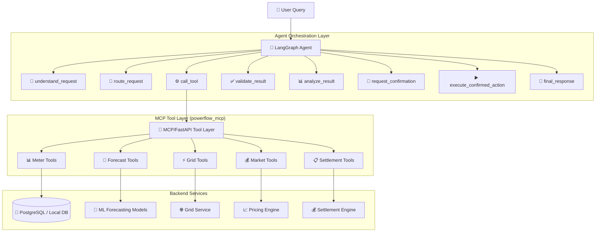

# ⚡ POWERFLOW LangGraph Agent

> **Production-quality AI Agent for grid-aware renewable energy P2P trading marketplace orchestration.**

The POWERFLOW LangGraph Agent acts as the **orchestration layer** between a local LLM (Qwen 2.5 3B via Ollama) and the POWERFLOW MCP/FastAPI tool layer. It understands user requests, decides which tools to call, validates results, and safely orchestrates the complete **read → analyze → recommend → confirm → act** workflow.

## 🏗️ Architecture



## ✨ Key Features

- **🎯 Intent Classification**: Automatically categorizes queries (forecast, market analysis, trade, etc.)
- **🔀 Conditional Routing**: Different flows for informational vs. state-changing requests
- **🛡️ Safety Boundaries**: Grid validation, confirmation requirements, order limits
- **📝 Full Traceability**: Execution history with tool calls, results, decisions
- **🔌 MCP Integration**: Clean tool interfaces to POWERFLOW backend
- **🏠 Local LLM**: Runs on 8GB RAM with Qwen 2.5 3B via Ollama
- **⚙️ Configurable**: Environment-based configuration, extensible LLM providers

## 📦 Project Structure

```
powerflow_agent/
├── __init__.py
├── config.py          # Pydantic settings from environment
├── state.py           # Strongly typed AgentState (Pydantic)
├── prompts.py         # LLM prompt templates
├── tools.py           # MCP tool interfaces & definitions
├── nodes.py           # LangGraph node implementations
├── router.py          # Conditional routing logic
├── graph.py           # LangGraph workflow definition
├── llm.py             # LLM provider abstraction
├── main.py            # CLI demo entry point
├── requirements.txt
├── .env.example
└── README.md
```

## 🚀 Quick Start

### Prerequisites

1. **Python 3.11+**
2. **Ollama** with Qwen 2.5 3B model:
   ```bash
   ollama pull qwen2.5:3b
   ollama serve
   ```
3. **POWERFLOW MCP Server** running (from parent directory):
   ```bash
   cd ..
   python -m powerflow_mcp.server --transport stdio
   ```

### Installation

```bash
cd powerflow_agent
pip install -r requirements.txt
cp .env.example .env
# Edit .env if needed
```

### Run Interactive Demo

```bash
python -m powerflow_agent.main
```

### Run Specific Query

```bash
python -m powerflow_agent.main -q "What is the expected demand for meter H011?"
```

### Run All Demos

```bash
python -m powerflow_agent.main --demo
```

## 💬 Example Conversations

| Query | Intent | Tools Called |
|-------|--------|--------------|
| "What is the expected demand for meter H011?" | `forecast_demand` | `get_demand_forecast` |
| "Is there enough local solar surplus for H001?" | `check_surplus` | `get_available_surplus`, `get_solar_forecast` |
| "Why is the current P2P price high on FEEDER-A?" | `market_analysis` | `get_market_price`, `get_grid_status`, `get_open_orders` |
| "Should I buy 2 kWh now?" | `buy_recommendation` | `get_demand_forecast`, `get_market_price`, `get_grid_status`, `get_available_surplus` |
| "Create a buy order for 2 kWh at ₹6/kWh" | `create_buy_order` | `get_market_price`, `get_grid_status` → **confirmation** → `create_buy_order` |

## 🔄 Agent Workflow

### Informational Requests (Auto-execute)
```
request → understand → route → call_tool → validate → analyze → final_response
```

### Analytical Requests (Multi-tool)
```
request → understand → route → call_tool (multiple) → validate → analyze → final_response
```

### Trade Requests (Confirmation Required)
```
request → understand → route → call_tool (market/grid) → validate → analyze 
  → request_confirmation → [user confirms] → execute_confirmed_action → final_response
```

## 🛡️ Safety Guarantees

1. **Grid Validation**: Every trade checks feeder headroom via `get_grid_status`
2. **Explicit Confirmation**: State-changing operations require user confirmation
3. **Order Limits**: Enforces min/max quantity (0.1-50 kWh) and price bounds (₹3-15/kWh)
4. **Role Verification**: Only prosumers can create sell orders
5. **No Hallucination**: Never invents missing values; explains limitations
6. **Audit Trail**: Complete execution history with timestamps

## ⚙️ Configuration

Key environment variables (see `.env.example`):

```bash
# LLM
LLM_PROVIDER=ollama
OLLAMA_MODEL=qwen2.5:3b
OLLAMA_BASE_URL=http://localhost:11434

# MCP
MCP_TRANSPORT=stdio
MCP_SERVER_COMMAND=python -m powerflow_mcp.server --transport stdio

# Safety
REQUIRE_CONFIRMATION_FOR_TRADES=true
MAX_ORDER_KWH=50.0
PRICE_FLOOR_INR=3.0
PRICE_CAP_INR=15.0
```

## 🧪 Testing

```bash
# Run agent tests
pytest tests/ -v

# Run with coverage
pytest tests/ --cov=powerflow_agent --cov-report=html
```

## 📊 Monitoring & Tracing

- **Execution Trace**: Every tool call logged with args, results, timing
- **State Persistence**: LangGraph MemorySaver for conversation continuity
- **Structured Logging**: JSON-formatted logs for analysis
- **Audit Log**: Cryptographic audit trail for state-changing operations

## 🔧 Extending the Agent

### Add New Intent
1. Add to `IntentType` enum in `state.py`
2. Add description in `prompts.py` 
3. Add routing rules in `router.py`
4. Add tool requirements in `router.py`

### Add New Tool
1. Add tool function in `tools.py`
2. Add to `TOOL_DEFINITIONS` for LLM function calling
3. Update categorization in `nodes.py:_categorize_tool_result`

### Change LLM Provider
```bash
# In .env
LLM_PROVIDER=openai
OPENAI_API_KEY=your-key
OPENAI_MODEL=gpt-4o-mini
```

## 📜 License

Part of the POWERFLOW project. See parent directory for license.