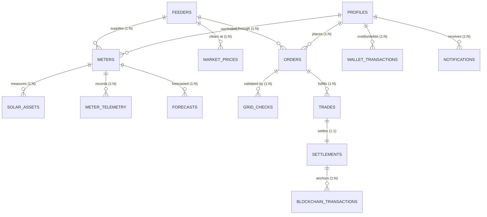

# ⚡ POWERFLOW Supabase PostgreSQL Architecture

POWERFLOW employs a production-grade **Supabase PostgreSQL** database engine configured with:
* **16 Relational Tables** with strict UUID PKs, foreign key cascades, and Indian grid regulatory constraints (INR ₹3.00–₹15.00/kWh, 90% feeder headroom ceiling, DISCOM ₹0.25/kWh wheeling fee).
* **12 Domain ENUM Types** ensuring data integrity across the entire marketplace lifecycle.
* **4 High-Performance Analytical Views** for instant marketplace analytics and cockpit monitoring.
* **9 Stored Procedures (RPCs)** executing atomic grid-safety validation, double-auction order matching, and settlement creation.
* **Granular Row Level Security (RLS)** enforcing zero-trust data access for Consumers, Prosumers, DISCOM Engineers, and Admins.
* **Realtime Publications** streaming live orderbook updates, telemetry, trades, and critical notifications to connected clients.
* **High-Fidelity Synthetic Dataset** pre-loaded with over 5,000 telemetry readings, 2,000 forecasts, 500 market price points, 250 orders, and 110 completed trades.

---

## 🏛️ Entity-Relationship Architecture



---

## 🗄️ Relational Schema Overview

### 1. Physical Distribution Grid & Telemetry
| Table | Description | Primary Key | Key Constraints |
|---|---|---|---|
| `feeders` | Physical 11kV/415V distribution feeders & distribution transformers | `id` (UUID) | Unique feeder_code, max_capacity_kw > 0, reverse_power_limit_kw > 0 |
| `meters` | Smart meters assigned to prosumers/consumers | `id` (UUID) | Unique meter_number, FK to profiles & feeders |
| `solar_assets` | Rooftop solar PV systems, panel capacities, inverter specs | `id` (UUID) | capacity_kw > 0, FK to meters & profiles |
| `meter_telemetry` | 15-minute telemetry intervals (kW generation, load, voltage, frequency) | `id` (UUID) | net_kw = generation_kw - load_kw, voltage_v (180-270V), frequency_hz (48-52Hz) |
| `forecasts` | ML solar generation and consumer demand 24-48h forecasts | `id` (UUID) | FK to meters/feeders, confidence_score (0.00-1.00) |

### 2. Marketplace & Grid Governance
| Table | Description | Primary Key | Key Constraints |
|---|---|---|---|
| `market_prices` | Dynamic market clearing prices calculated by pricing engine | `id` (UUID) | ₹3.00 <= price_inr_per_kwh <= ₹15.00 |
| `orders` | Buy and Sell energy orders placed by market participants | `id` (UUID) | ₹3.00 <= price <= ₹15.00, Pure consumers CANNOT SELL |
| `grid_checks` | Real-time automated physical grid headroom evaluations | `id` (UUID) | Feeder load <= 90% threshold, triggers GRID_CONGESTION_REJECTION |
| `trades` | Matched energy trades between buyers and sellers | `id` (UUID) | FK to buy_order_id, sell_order_id, feeder_id |

### 3. Financial Settlement & Blockchain Proof
| Table | Description | Primary Key | Key Constraints |
|---|---|---|---|
| `settlements` | Multi-party financial settlements with DISCOM wheeling charge | `id` (UUID) | discom_wheeling_fee_inr = energy_kwh * ₹0.25, gross = net + fee |
| `blockchain_transactions` | EVM/Hardhat immutable hash proofs of settlements | `id` (UUID) | Unique tx_hash, block_number, contract_address |
| `wallet_transactions` | INR Ledger accounts for market participants | `id` (UUID) | FK to profiles & settlements, signed amount balance |

### 4. Identity, Security & AI Observability
| Table | Description | Primary Key | Key Constraints |
|---|---|---|---|
| `profiles` | User identity linked with Supabase `auth.users` | `id` (UUID) | Role: `consumer`, `prosumer`, `discom_engineer`, `regulator`, `admin` |
| `notifications` | Critical alerts (congestion, trade execution, wallet credits) | `id` (UUID) | Realtime enabled, read/unread state |
| `audit_logs` | Cryptographic audit trail of all sensitive operations | `id` (UUID) | Actor ID, client IP, action hash, payload JSONB |
| `agent_execution_logs`| LangGraph + MCP AI agent thought process and tool execution | `id` (UUID) | Session ID, latency_ms, tool_call JSONB, HITL flag |

---

## ⚡ Stored Procedures (RPCs)

The schema provides 9 PostgreSQL functions callable directly from frontend/backend via Supabase RPC:

1. `fn_check_grid_safety(p_feeder_id, p_energy_kwh, p_side)`
   - Computes real-time transformer utilization and reverse power flow.
   - Returns boolean safety decision (`is_safe`), current headroom, and congestion status.
2. `fn_get_available_surplus(p_meter_id)`
   - Queries latest smart meter telemetry to verify physical surplus before order creation.
3. `fn_create_validated_order(...)`
   - Validates role permissions, verifies prosumer solar surplus, checks physical feeder safety, and creates order atomically.
4. `fn_match_orders(p_feeder_id)`
   - Implements bounded double-auction matching between complementary buy and sell orders.
5. `fn_create_settlement(p_trade_id)`
   - Deducts DISCOM wheeling charge (₹0.25/kWh), credits prosumer, debits consumer, and updates order fill states.
6. `fn_get_marketplace_energy(p_feeder_id)`
   - Aggregates active surplus generation and open buy demand for market cockpits.
7. `fn_get_feeder_health(p_feeder_id)`
   - Returns voltage stability, frequency regulation, and transformer load metrics.
8. `fn_get_wallet_balance(p_user_id)`
   - Calculates real-time reconciled wallet balance from transactional ledger.
9. `fn_record_audit_event(p_actor_id, p_action, p_entity, p_payload)`
   - Ingests tamper-evident audit records for regulatory compliance.

---

## 🛡️ Row Level Security (RLS) Matrix

| Entity / Table | Consumer | Prosumer | DISCOM Engineer | Regulator |
|---|---|---|---|---|
| `profiles` | Own profile only | Own profile only | All profiles in jurisdiction | Read-all |
| `meters` & `solar_assets` | Own meter only | Own meter & solar assets | All meters on feeder | Read-all |
| `meter_telemetry` | Own readings | Own readings | Feeder aggregate & readings | Read-all |
| `orders` | Own orders + Public Book | Own orders + Public Book | Full feeder orderbook | Read-all |
| `trades` & `settlements` | Counterparty trades | Counterparty trades | Full feeder settlements | Read-all |
| `audit_logs` | Denied | Denied | Denied | Read-all |

---

## 🚀 How to Apply the Migration

### Option A: Via Supabase CLI (Recommended)
```bash
# 1. Login and link project
supabase login
supabase link --project-ref your-supabase-project-ref

# 2. Push migration
supabase db push
```

### Option B: Via Supabase Web Studio SQL Editor
1. Log in to [https://supabase.com/dashboard](https://supabase.com/dashboard).
2. Open your project and navigate to the **SQL Editor** tab.
3. Paste the contents of `supabase/migrations/20260912000000_powerflow_schema.sql`.
4. Click **Run**. All tables, enums, triggers, RPC functions, RLS policies, and sample datasets will be created in one transaction.

### Option C: Local PostgreSQL / Docker
```bash
psql -h localhost -U postgres -d powerflow -f supabase/migrations/20260912000000_powerflow_schema.sql
```
